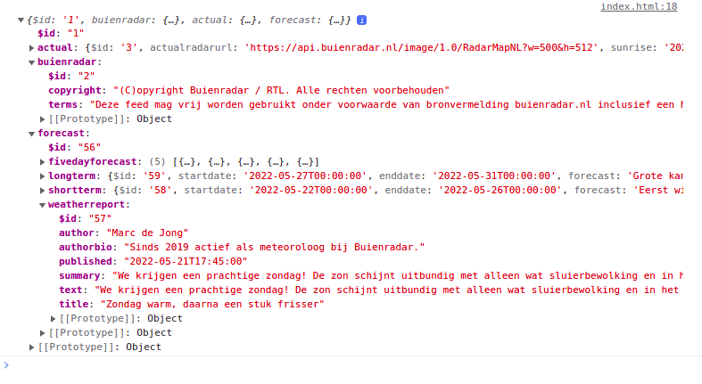

# Buienradar App

In de laatst informatica lessen gaan we aan de slag met een API. Dit is een manier waarop je data kunt ophalen van andere websites of computer programma's. Wij maken hier gebruik van de Buienradar API. Hierin zit de weerdata van Nederland. Je kunt dan denken aan de data van de weerstations die verspreid over Nederland staan, of de weervoorspelling voor de komende dagen.

Je krijgt toegang tot een voorbeeld app die jij aan de hand van een functioneel ontwerp gaat aanpassen. De aanpassingen kun je doen met de kennis die je hebt opgedaan in de JavaScript Basis opdrachten (for loops, if/else). Maak er iets moois van!

## Voorbeeld App

Nu kun je de broncode van de voorbeeld app downloaden. Je ziet hierin al een basis HTML pagina, met inline CSS en inline JavaScript.

[voorbeeld app](/voorbeeld_app/index.html)

In de voorbeeld app wordt de data van Buienradar al opgehaald met de functie fetch. Dit is een iets efficientere manier om JSON data op te halen dan XMLHttpRequest. XMLHttpRequest wordt ook nog steeds ondersteund door de meeste browsers, dus ook deze methode kun je nog gebruiken om data op te halen via een API. 

De data wordt verstuurd in een JSON object. Een JSON object kun je zien als inhoudsopgave. Als je een bepaald hoofdstuk wilt opzoeken hoef je alleen maar in de inhoudsopgave te kijken in plaats dat je het hele boek gaat doorzoeken. Een JSON object werkt ongeveer hetzelfde. Het bestaat uit een zogenaamde key, bijvoorbeeld forecast, met daarachter een value (een waarde). Soms zijn deze key-value paren genest (in elkaar). In JSON kun je op deze manier de deelhoofdstukken zoeken. Als voorbeeld:

```javascript
jsonData.forecast.weatherreport.summary;
```



De waardes uit dit JSON object verwerk je in je eigen app.

## Functioneel ontwerp

Maak een functioneel ontwerp om de voorbeeld app aan te passen. Maak een compleet document waar het volgende in is verwerkt:

1. Je doelgroep
2. Eisen en wensen waar de app aan moet voldoen
3. Maak een aantal user stories: Als ... wil ik ...zodat ik ...
4. Structuur
5. Basis elementen
6. Schermontwerp

## Aanpassingen maken

Pas de voorbeeld app aan zodat het voldoet aan de eisen en wensen zoals je deze in je functioneel ontwerp hebt opgeschreven. Je krijgt alle vrijheid om de HTML pagina, de CSS en de JavaScript aan te passen. 

Heb je een beetje hulp nodig om de JSON opdracht en JavaScript te combineren? Kijk dan voor wat hints op deze [pagina](APIs.md)

## Inleveren

Lever je functioneel ontwerp, het .html bestand (of als je meerdere bestanden hebt een .zip bestand), en een logboek waarin is opgeschreven wie wat heeft gedaan in.