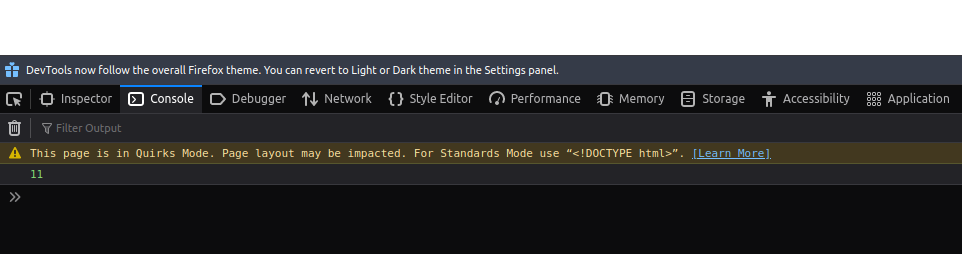
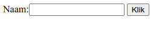

# JavaScript

Met JavaScript kun je webpagina's dynamisch maken. Je kunt vanaf je webpagina de gebruiker om input vragen en dit verwerken. Je gaat in de volgende opdrachten kennis maken hoe JavaScript gebruikt kan worden in jouw website.

## Les 1: Basis

JavaScript schrijf je tussen de head-tags van je webpagina. Je kunt hier direct JavaScript code in schrijven. Dit script wordt uitgevoerd als de webpagina geladen wordt. Met het commando document.write() schrijf je direct op de blanco webpagina.

```html
<head>
  <title>JavaScript Les 1</title>
  <script>
    document.write(5 + 6);
  </script>
</head>
<body>
  
</body>
```

Je kunt ook uitvoer op de pagina tonen op andere manieren. Het is ook mogelijk om een pop-up te tonen. Pop-ups moeten dan wel worden toegestaan in de browser.

```html
<head>
  <title>JavaScript Les 1</title>
  <script>
    window.alert(5 + 6);
  </script>
</head>
<body>
  
</body>
```

Je ziet al verschil tussen de 2 commando's. In de eerste staat document, en in de tweede window. Het document is dus de webpagina en window is het browser window waar de output (uitvoer) op verschijnt. 

Er is nog een derde manier om uitvoer te krijgen van JavaScript. Via de web-console.

```html
<head>
  <title>JavaScript Les 1</title>
  <script>
    console.log(5 + 6);
  </script>
</head>
<body>
  
</body>
```

Als je de pagina nu laad zie je op het eerste gezicht niks. Maar je kunt in Firefox of Chrome de pagina inspecteren. Druk op de rechter muisknop en klik op Inspect of Inspecteren. In het Inspect venster klik je op console. Als het goed is, zie je daar het resultaat van je uitvoer.



Je weet nu hoe je op verschillende manieren JavaScript uitvoer op je scherm krijgt. Dit is nog maar het begin, want je kunt een heleboel met JavaScript. Het is een van de oudste en meest gebruikte programmeertaal op het web! In de volgende opdracht ga je verder met het leren van JavaScript.

## Les 2: Loops

In de vorige opdracht heb je al een sommetje gezien: 5+6. Nu is dat iets wat we zelf ook wel kunnen uitrekenen. Maar we kunnen dit natuurlijk moeilijker maken. Voor bijvoorbeeld sommen die we zelf iets lastiger vinden. De tafels, of zelfs de stelling van pythagoras. Je kunt dit handmatig uittikken, maar programmeurs zijn lui en maken liever gebruik van slimme functies. Een daarvan is de loop, of in het Nederlands, een herhaling. 

In JavaScript ziet dat er bijvoorbeeld zo uit:

```javascript
for (statement 1; statement 2; statement 3) {
  // commando om uit te voeren
}
```

In het eerste stukje (statement 1), zet je een standaard waarde. Dit gedeelte wordt maar 1 keer uitgevoerd aan het begin van het code blok. 

Het tweede stukje (statement 2), definieerd de voorwaarde voor het code blok. Dit is een stukje wat bij iedere herhaling van het blok wordt gecontrolleerd. Bijvoorbeeld of de standaard waarde aan het begin nog steeds kleiner is dan 5: i < 5.

Het laatste stukje (statement 3) wordt iedere keer uitgevoerd zolang de drempel uit stukje 2 nog niet is bereikt. Bijvoorbeeld het ophogen van de standaard waarde uit het eerste deel.

In de praktijk ziet dat er dan zo uit:

```javascript
for (let i = 0; i < 5; i++) {
    console.log("Het getal is " + i );
}
```

### Opdracht 1

- [] Maak een webpagina die de tafel van 13 weergeeft. 
- [] Stop in dezelfde pagina een geheim bericht, wat je alleen kunt zien als iemand de console inspect opent.

## Les 3: Formulieren

We hebben nu kennis gemaakt met wat JavaScript kan. Zoals in het begin van de opdrachten vertelde ik al dat je met JavaScript ook input van de gebruiker kunt verwerken. Je maakt hiervoor eerst een webformulier. Dit mag heel basic zijn. De invoer van het webformulier print je in de console of direct op de webpagina.



Hiervoor maakt je een functie aan. Deze functie wordt aangeroepen als je bijvoorbeeld ergens op klikt. Een plaatje of een knop. 

```html
<script>
      function zegHallo(){
            //Hier komt JavaScript-code                                               
      }
</script>
</head>
<body>
  <button type="button" onclick="zegHallo()">Klik</button>
</body>
```

### Opdracht 2

- [] Google hoe je een html webformulier maakt. Maak een formulier met 1 invoerveld en een knop waarmee je de input kunt verwerken. Vraag bijvoorbeeld om de naam, en geef deze na het indrukken van de knop terug als: Hallo 'naam'
- [] Nu je een formulier hebt kun je je vorige opdracht van de tafels uitbreiden. De gebruiker geeft zelf een waarde in die vermenigvuldigd wordt.

## Les 4: If Else


### Opdracht 3

- [] Maak een webpagina waar je steen, papier schaar tegen de computer speelt. Bij deze opdracht kan je de onderstaande functie gebruiken om de computer steen, papier of schaar te laten kiezen.

```javascript
function kiesOptie() {
    let opties =  ['steen', 'papier', 'schaar']; 
    return opties[Math.floor(Math.random() * opties.length)];
}
```
